# Fitness Center Management System
This is a course project for INFSCI 2710 Database Management Systems
project link: https://github.com/Mirandayao0/SQL
The Fitness Management System is a Spring Boot application designed to manage a gym's customer, 
employee, and service data. It includes features to manage memberships, transactions, schedules, and more. 
The application provides a RESTful API to interact with the underlying database, 
allowing for easy integration with various clients.

## Features
* Store and manage customer, employee, service, schedule, transaction, payment, membership, invoice, and payment method data
* Perform CRUD operations on the database tables
* Expose a RESTful API for data retrieval and manipulation
* Provide JSON-formatted output for API endpoints

## Setup
### note we are running on local laptop, so we need to install sql server and lanuch first
* by check if sql server is running background, run `ps aux | grep mysql`
```
ps aux | grep mysql
_mysql           66123   0.4  0.1 34811572  17772   ??  Ss   11:59AM   0:41.43 /usr/local/mysql/bin/mysqld --user=_mysql --basedir=/usr/local/mysql --datadir=/usr/local/mysql/data --plugin-dir=/usr/local/mysql/lib/plugin --log-error=/usr/local/mysql/data/mysqld.local.err --pid-file=/usr/local/mysql/data/mysqld.local.pid --keyring-file-data=/usr/local/mysql/keyring/keyring --early-plugin-load=keyring_file=keyring_file.so

```
### then on mySql workbench side, start new connection in MySql Connection, then run the query (*.sql file)

### python env (one time)
    * Create conda environment or venv for Python
    * conda env create -f requirement.yml, note this file contain all dependency libraries.
### Start the API
    *  	`conda activate sql`
    * 	`python API.py`, note please edit the password value before each run, current value sithe same as server.
correct output is 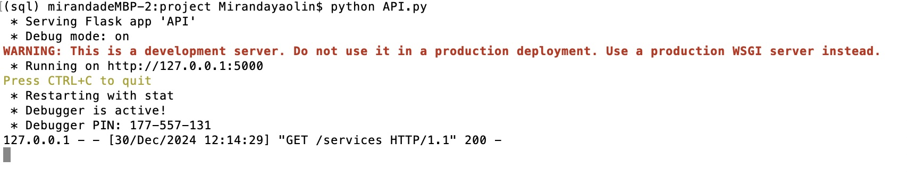
###  Open Postman
- Start a new request in a new collection and **add Content-Type=application/json in Headers**

#### Class Diagram
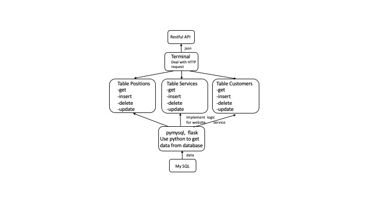

#### select and display data from customers,postions,services
[GET] http://127.0.0.1:5000/services
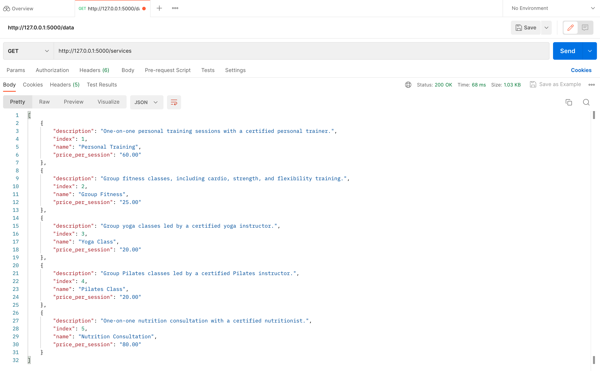

[GET] http://127.0.0.1:5000/customers
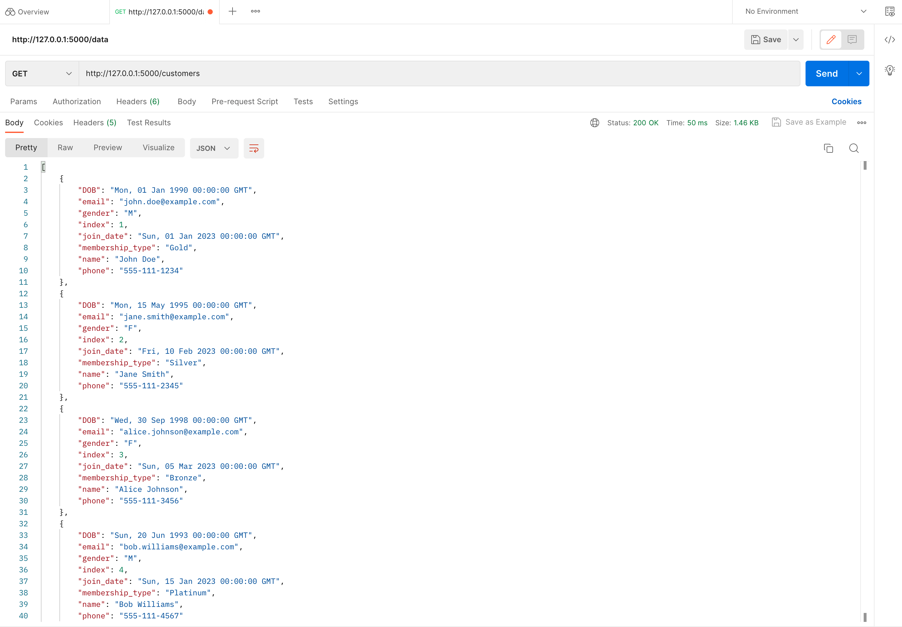

[GET] http://127.0.0.1:5000/positions


#### insert data to services
[post] http://127.0.0.1:5000/services
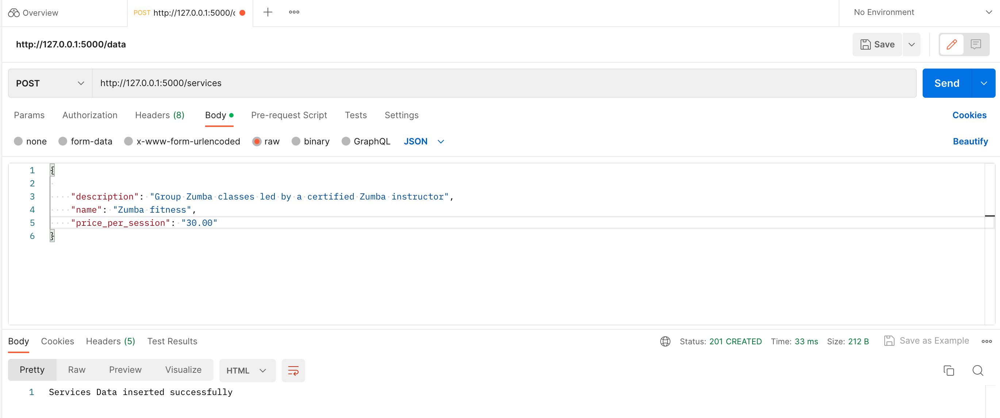

#### insert data to customers
[post] http://127.0.0.1:5000/customers
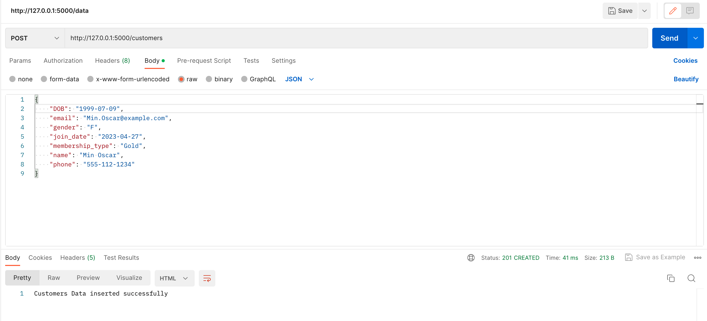

#### insert data to positions
[post] http://127.0.0.1:5000/positions
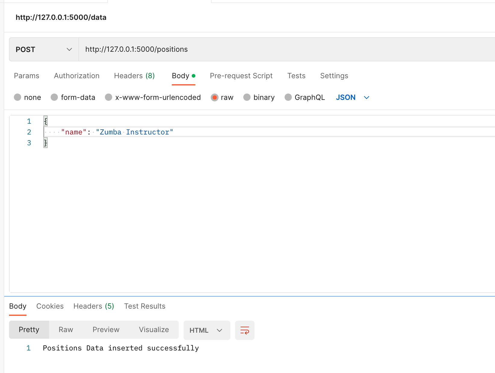


#### update data to services
[update] http://127.0.0.1:5000/services/1
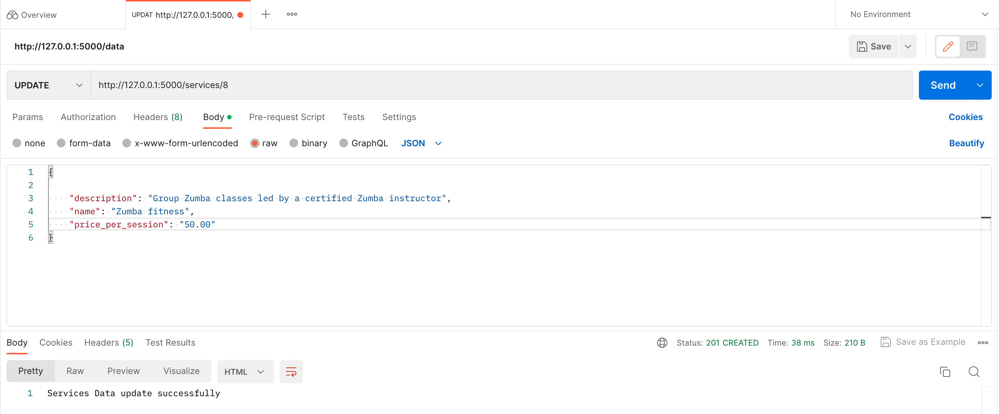

#### update data to customers
[update] http://127.0.0.1:5000/customers/1


#### update data to positions
[update] http://127.0.0.1:5000/positions/1
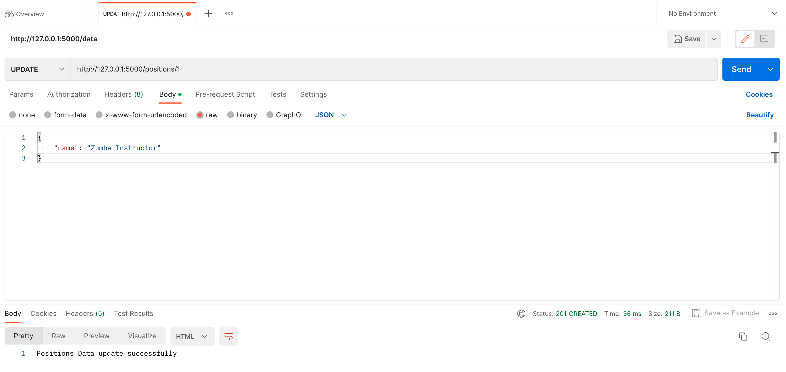

#### delete data to services
[delete] http://127.0.0.1:5000/services/1
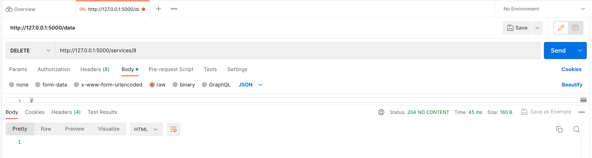

#### delete data to customers
[delete] http://127.0.0.1:5000/customers/1
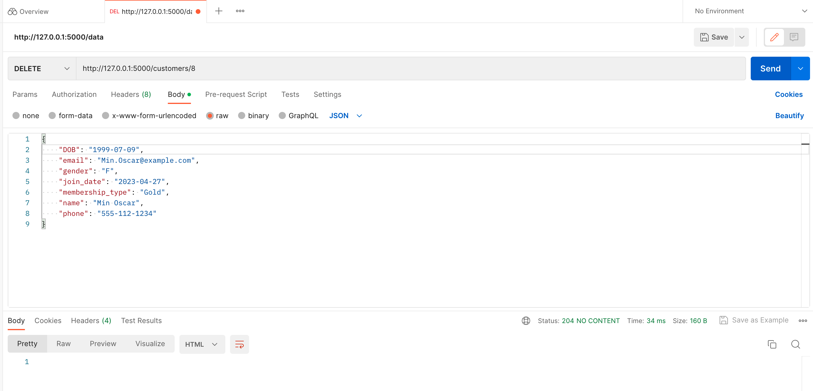

#### delete data to positions
[delete] http://127.0.0.1:5000/positions/1
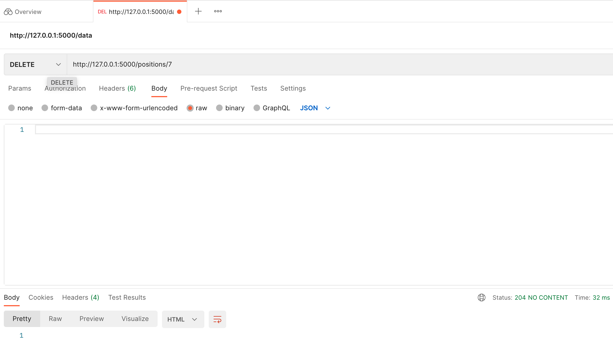
